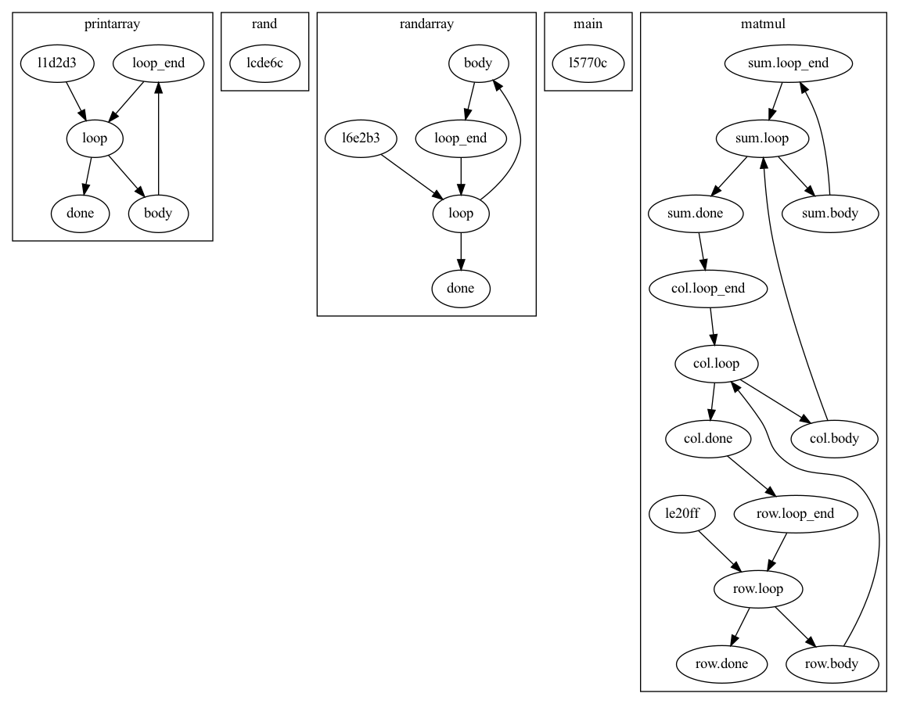

# bril-processing

This is a repository for CS 6120 course projects and assignments. It contains Scala code used to
perform operations on Bril programs.

## CFG Generation (Lesson 2)

The class `bril.run.BrilCfg` reads a Bril program in JSON and produces `Graphviz` output which
can be piped to `dot -Tpng` to create a graphical representation. The script `bril/scripts/run bril.run.BrilCfg`
will call the right files.

```
bril2json < /path/to/bril/program | bril-processing/scripts/run bril.run.BrilCfg | dot -Tpng > cfg.png
```

Some sample graphs generated by the script can be found in `bril-processing/test/graphs`; like the one below.



## CFG Degrees (Lesson 2)

The class `bril.run.BrilDegrees` reads a Bril program in JSON and calculates how many
basic blocks have a given in-degree and out-degree. The script `bril-processing/scripts/run bril.run.BrilDegrees`
will call the right files.

```
bril2json < /path/to/bril/program | bril-processing/scripts/run bril.run.BrilDegrees
```

There is a `Turnt` test specification in `bril-processing/test/degrees`.

## Dead Code Elimination (Lesson 3)

The class `bril.run.BrilDce` reads a Bril program in JSON and performs dead code elimination. It
does both local reassignment elimination and global unused statement removal.
The actual code for performing LVN is in the class
[`bril.optim.BrilDce`](src/main/scala/bril/optim/BrilDce.scala). The script
`bril-processing/scripts/run bril.run.BrilDce` will call the right files.

```
bril2json < /path/to/bril/program | bril-processing/scripts/run bril.run.BrilDce
```

There is a `Turnt` test specification in `bril-processing/test/tdce`.

## Local Value Numbering (Lesson 3)

The class `bril.run.BrilLvn` reads a Bril program in JSON and performs local value numbering
based optimisations. The actual code for performing LVN is in the class
[`bril.optim.BrilLvn`](src/main/scala/bril/optim/BrilLvn.scala).
It performs the following optimisations:
* Copy propagation
* Common subexpression elimination
* [Constant folding](src/main/scala/bril/optim/BrilConstant.scala)

The script `bril-processing/scripts/run bril.run.BrilLvn` will call the right files.

```
bril2json < /path/to/bril/program | bril-processing/scripts/run bril.run.BrilLvn
```

There is a `Turnt` test specification in `bril-processing/test/lvn`. Because of the use of random identifiers in
the LVN algorithm, there is a possibility that some tests will fail. You can verify with `--diff` flag of `turnt` that
the only difference between the two outputs is the randomized variable name.
